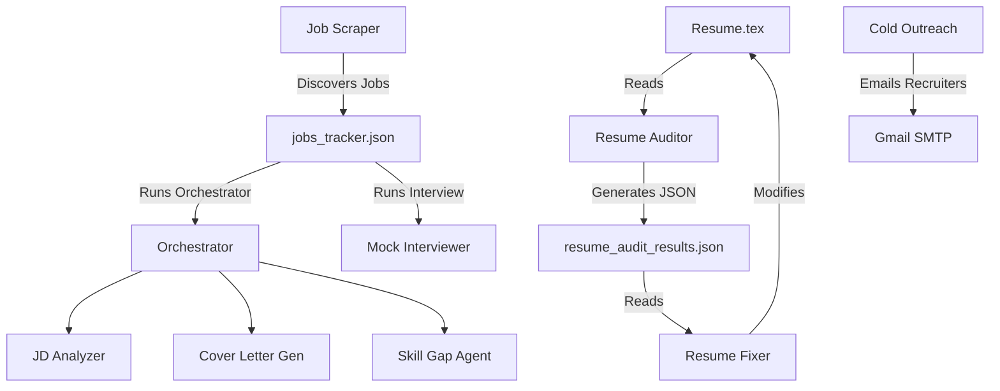

# Master Project Context & Architectural Memory

This document is the single source of truth for the **Job Application & Outreach Automation Suite**. It describes the workspace structure, agent roles, database schemas, API routes, system workflows, and runtime constraints. Read this file to understand the complete inner workings of the application.

---

## 📂 Reorganized Workspace Directory Structure

The project follows a clean, modular folder hierarchy:

```text
├── resumes/                 # Resume drafts, context files, and archives
│   ├── Resume.tex           # Baseline AI/GenAI LaTeX resume
│   ├── Resume.pdf           # Compiled AI resume PDF
│   ├── Resume_Support.tex   # L2 Application Support & ITSM LaTeX resume
│   ├── Resume_Support.pdf   # Compiled L2 Support resume PDF
│   ├── career_context.md    # Master career context file (Shubham Reddy / TCS details)
│   ├── backups/             # Name-matched timestamped LaTeX backups
│   └── archive/             # Old resume iterations
│
├── data/                    # JSON data stores and excel spreadsheets
│   ├── Consultancies.xlsx   # Outreach target Excel sheet
│   ├── user_config.json     # User configurations (active resume/context paths, profile details)
│   ├── emailed_status.json  # Outreach campaign logs (merged with excel)
│   ├── jobs_tracker.json    # Scraped jobs database (approved list)
│   ├── discovered_jobs.json # Scraped jobs pending review
│   ├── discovered_agencies.json # Found consultancies pending approval
│   ├── resume_audit_results.json # Results of the latest resume audit run
│   └── agent_metrics.json   # Running metrics and statuses of the 11 agents
│
├── logs/                    # Operational logs
│   ├── server.log           # Web dashboard server execution log
│   ├── scraper_run.log      # Stealth crawler run diagnostics
│   ├── scrape_db_links.log  # Link scraping tracker logs
│   ├── resume_audit.log     # Logs for the Resume Auditor Agent
│   └── resume_fix.log       # Logs for the Resume Fixer Agent
│
├── dashboard_public/        # Static frontend dashboard assets
│   └── index.html           # Single-page web dashboard (HTML, CSS, JS, Observability panel)
│
├── docs/                    # Architecture documents and reports
│   └── assets/              # Reorganized screenshot assets for docs
│
├── scratch/                 # Temporary testing and sandbox files
├── venv/                    # Local Python virtual environment
│
├── src/                     # Core Python source packages
│   ├── agents/              # 11 Specialized agent implementations
│   │   ├── __init__.py
│   │   ├── cover_letter_generator.py
│   │   ├── jd_analyzer.py
│   │   ├── job_agent.py
│   │   ├── mock_interview_agent.py
│   │   ├── orchestrator.py
│   │   ├── resume_agent.py
│   │   ├── resume_auditor.py
│   │   ├── resume_fixer.py
│   │   └── skill_gap_agent.py
│   │
│   ├── scrapers/            # Web scraper agents
│   │   ├── __init__.py
│   │   ├── agency_scraper.py
│   │   └── job_scraper.py
│   │
│   ├── server/              # Web dashboard server implementation
│   │   ├── __init__.py
│   │   └── server.py
│   │
│   └── __init__.py          # Marks src as a package
│
├── dashboard_server.py      # Root-level backward-compatible wrapper scripts
├── orchestrator.py
├── resume_agent.py
├── resume_auditor.py
├── resume_fixer.py
├── job_scraper.py
├── agency_scraper.py
├── job_agent.py
├── mock_interview_agent.py
├── jd_analyzer.py
├── cover_letter_generator.py
├── skill_gap_agent.py
└── requirements.txt         # Python libraries
```

---

## 🛠️ Complete Agent Registry

We have **11 specialized agents** that automate different stages of the application lifecycle:



### 1. Resume Auditor Agent (`resume_auditor.py`)
- **Responsibility**: Checks the LaTeX resume for syntax errors, chronological/duration mismatches (joined TCS in May 2024), alignment issues against target goals, and strict constraints.
- **Rules Enforced**: 
  - Microsoft Copilot Studio agent must be 100% no-code.
  - Math characters (like `\sim` or `\approx`) must be enclosed in math delimiters `$` inside LaTeX text.
- **Usage**: `python resume_auditor.py --goal "AI Engineer"`
- **Outputs**: `data/resume_audit_results.json`

### 2. Resume Fixer Agent (`resume_fixer.py`)
- **Responsibility**: Consumes audit findings, uses Gemini to apply corrections to the LaTeX code, displays a diff, and compiles it to PDF.
- **Usage**: `python resume_fixer.py` (Supports `--diff-only`, `--no-pdf`, `--no-backup`)
- **Outputs**: Modifies `resumes/Resume.tex`, saves backup, compiles `resumes/Resume.pdf`.

### 3. Resume Customizer (`resume_agent.py`)
- **Responsibility**: Takes natural-language prompt instructions from the CLI and updates specific sections of the LaTeX resume.
- **Usage**: `python resume_agent.py "Add Kubernetes to supporting skills"`

### 4. JD Analyzer Agent (`jd_analyzer.py`)
- **Responsibility**: Compares a job description text against the candidate's resume and context. Calculates suitability score (0-100), parses matching/missing skills, recommends resume revisions, and generates potential interview questions.
- **Outputs**: Structured `JobAnalysis` model.

### 5. Cover Letter Gen Agent (`cover_letter_generator.py`)
- **Responsibility**: Creates a highly tailored, brief, professional cover letter matching the candidate's profile to the target job description.

### 6. Skill Gap Agent (`skill_gap_agent.py`)
- **Responsibility**: Evaluates missing skills from a job description and formulates a weekly roadmap/study plan to bridge the gap.

### 7. Master Orchestrator (`orchestrator.py`)
- **Responsibility**: Runs the JD Analyzer, Cover Letter Generator, and Skill Gap Agent sequentially.
- **Usage**: `python orchestrator.py --link "URL" --jd-text "Raw text"`
- **Outputs**: Updates the job's entry in `data/jobs_tracker.json` or `data/discovered_jobs.json`.

### 8. Job Scraper Agent (`job_scraper.py`)
- **Responsibility**: Periodically searches job boards (Lever, Greenhouse, Workable) for roles matching target keywords and location, filtering out mismatching listings via Gemini.
- **Outputs**: Appends to `data/discovered_jobs.json`.

### 9. Agency Scraper Agent (`agency_scraper.py`)
- **Responsibility**: Discovers recruitment consultancies/agencies in the target area.
- **Outputs**: Appends to `data/discovered_agencies.json`.

### 10. Cold Outreach Agent (`job_agent.py`)
- **Responsibility**: Parses target list, drafts personalized cold emails mentioning candidate credentials and consultancy focus, displays draft for review/edit, and emails recruiters via Gmail SMTP with `Resume.pdf` attached.
- **Usage**: `python job_agent.py`

### 11. Mock Interviewer Agent (`mock_interview_agent.py`)
- **Responsibility**: Simulates a live, conversational, turn-based technical screening interview based on the job description and resume.
- **Outputs**: Interactive conversation history.

---

## 🗄️ Data Store Specifications

The JSON databases in `data/` are defined below:

### `data/user_config.json`
Stores the active resume target, career context paths, locations, and profile details used by the crawler scripts.
```json
{
  "target_location": "India",
  "experience_level": "Mid-Senior",
  "search_keywords": "Python, LangGraph",
  "resume_file_path": "resumes/Resume.tex",
  "context_file_path": "resumes/career_context.md",
  "enabled_sources": ["google_ats", "naukri"],
  "profile": {
    "full_name": "Shubham Reddy",
    "email": "shubhamreddy9172@gmail.com",
    "phone": "+91-9172587538",
    "linkedin": "https://www.linkedin.com/in/shubham-vivek-reddy/",
    "github": "https://github.com/shubhamr9172",
    "portfolio": "https://sr-portfolio.vercel.app",
    "current_company": "Tata Consultancy Services (TCS)",
    "experience_years": "2"
  }
}
```

### `data/emailed_status.json`
Tracks the status of recruitment consultancies to prevent duplicate emailing campaigns.
```json
{
  "Agency Name": {
    "status": "sent | pending_email | pending_web_form | responded | interviewing | skipped",
    "email": "recruiter@agency.com",
    "website": "https://agency.com",
    "note": "Sent follow-up email",
    "timestamp": "2026-05-25T09:00:00Z"
  }
}
```

### `data/jobs_tracker.json`
Main database of tracked, approved job applications, including details of AI analysis, cover letter, and interview chats.
```json
[
  {
    "title": "AI Engineer",
    "company": "Tech Corp",
    "location": "Remote",
    "link": "https://jobs.lever.co/techcorp/123",
    "source": "google_ats",
    "description": "Job description content...",
    "status": "pending_apply | applied | interviewing | offer | rejected_app",
    "notes": "My notes...",
    "suitability_score": 85,
    "matching_skills": ["Python", "RAG"],
    "missing_skills": ["LangGraph"],
    "key_responsibilities": ["Build LLM pipelines"],
    "resume_suggestions": ["Highlight LangGraph project"],
    "typical_interview_questions": ["Explain your RAG pipeline"],
    "cover_letter": "Dear Hiring Team...",
    "study_plan": "Week 1: Learn LangGraph...",
    "interview_chat_history": [
      {"role": "user", "text": "Hello, ready for interview"},
      {"role": "model", "text": "Welcome. Question 1..."}
    ],
    "added_at": "2026-05-25T08:00:00Z",
    "updated_at": "2026-05-25T09:00:00Z"
  }
]
```

### `data/resume_audit_results.json`
Saves findings of the latest resume audit for the fixer agent.
```json
{
  "overall_quality_score": 85,
  "general_feedback": "Resume is well-structured...",
  "findings": [
    {
      "description": "LaTeX escape syntax error...",
      "severity": "critical",
      "location": "Experience section...",
      "recommended_correction": "Change \\sim to $\\sim$."
    }
  ]
}
```

### `data/agent_metrics.json`
Exposes real-time status and operational statistics for the 11 agents.
```json
{
  "resume_auditor": {
    "status": "idle | running | error",
    "last_run_status": "success | failure",
    "last_run_timestamp": "2026-05-25T09:30:00Z",
    "run_count": 5,
    "avg_latency_sec": 14.5,
    "total_tokens_used": 18200
  }
}
```

---

## 🔌 HTTP API Endpoint Reference

The backend HTTP server runs on `http://localhost:8000` via `dashboard_server.py`.

### GET Endpoints
- **`/api/status`**: Merges Excel consultancies and `emailed_status.json` and returns the unified outreach list.
- **`/api/replies`**: Logs into Gmail via IMAP, pulls the latest 50 messages, matches domains against agencies, flags replies, and returns matching threads.
- **`/api/discovered`**: Returns discovered recruitment consultancies pending approval.
- **`/api/config`**: Returns `data/user_config.json` parameters along with background scraper running states.
- **`/api/jobs/status`**: Returns tracked, active applications from `data/jobs_tracker.json`.
- **`/api/jobs/discovered`**: Returns scraped job postings waiting for user review.
- **`/api/agents`**: Returns current status, statistics, and metrics for all 11 agents.
- **`/api/logs?agent=<agent_name>&lines=<number>`**: Reads and returns the last N lines from the requested agent's log file.

### POST Endpoints
- **`/api/update`**: Saves manual edits (status, note updates) for an agency in `emailed_status.json`.
- **`/api/test-imap`**: Tests IMAP connection configuration in `.env`.
- **`/api/discovered/approve`**: Approves a discovered agency, adding it to the active outreach queue.
- **`/api/discovered/reject`**: Rejects a discovered agency.
- **`/api/config`**: Saves configurations into `data/user_config.json`.
- **`/api/config/parse-resume`**: Uploads a PDF/text resume, parses profile fields using regex heuristics, and returns extracted fields.
- **`/api/jobs/update`**: Updates status/notes for a tracked application.
- **`/api/jobs/discovered/approve`**: Approves a discovered job, migrating it to `jobs_tracker.json`.
- **`/api/jobs/discovered/reject`**: Rejects a discovered job posting.
- **`/api/jobs/scrape`**: Spawns `job_scraper.py` in the background.
- **`/api/jobs/analyze`**: Runs `orchestrator.py` sequentially for a job posting.
- **`/api/jobs/save-cl`**: Saves manual text edits to a job's Cover Letter.
- **`/api/jobs/mock-interview`**: Simulates conversational turn-based mock interview chat.
- **`/api/resume/audit`**: Spawns `resume_auditor.py` and returns the new audit findings.
- **`/api/resume/fix`**: Spawns `resume_fixer.py` (running fixes and compilation), returning execution log, diff, and compile status.

---

## ⚙️ Execution Guidelines & Troubleshooting

### 🐍 Virtual Environment Activation
Always launch scrapers, servers, and agents from the workspace virtual environment:
* **Windows (PowerShell)**: `.\venv\Scripts\Activate.ps1`
* **Windows (Command Prompt)**: `venv\Scripts\activate.bat`

### 🔑 Required Environment Configurations (`.env`)
Create a `.env` in the root workspace directory with:
```env
GEMINI_API_KEY=your_google_ai_studio_api_key
GMAIL_USER=your_gmail_address@gmail.com
GMAIL_APP_PASSWORD=your_16_character_app_password
```

### 🧟 Handling Zombie Processes & Port Conflicts
If port `8000` is blocked by a previous server run on Windows, terminate it:
```powershell
# Find process ID blocking port 8000
netstat -ano | findstr :8000
# Kill process
taskkill /F /PID <PID>
```
