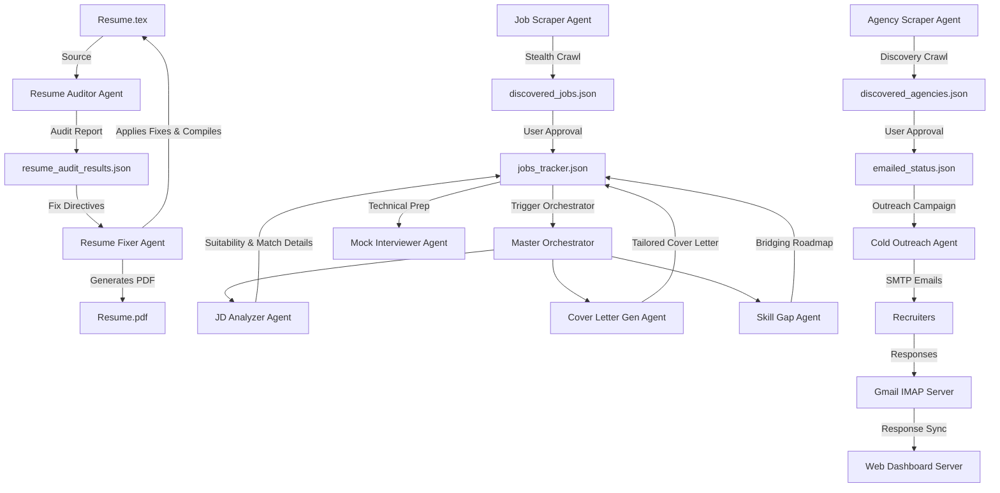

# Job Application & Outreach Automation Suite

An enterprise-grade, end-to-end automation suite designed to streamline job discovery, tracking, candidate profiling, resume optimization, and cold recruiter outreach. 

The suite is anchored by a glassmorphic local Web Dashboard, powered by **11 specialized Google Gemini AI agents**, and utilizes stealthy crawlers.


---

## 📐 System Architecture & Design

The suite uses a modular, event-driven agent architecture where each agent is responsible for a distinct phase of the job application lifecycle. The agents share state through local JSON datastores and are coordinated via the Web Dashboard or a CLI-driven Master Orchestrator.




### Core Design Principles
1. **Dynamic Config Injection**: All agents read settings dynamically from `data/user_config.json`. Switching target resumes or candidate details modifies behaviors system-wide.
2. **Human-in-the-Loop Validation**: Automated processes (scraping, audits, and outreach drafts) stop at human approval gates prior to taking action.
3. **Glassmorphic Observability**: The Web Dashboard provides real-time logs, process states, and latency/token-use telemetry for all 11 active agents.

---

## 🔄 Core Application Flow

### Phase 1: Resume Verification & Compilation
The candidate maintains LaTeX sources under the `resumes/` folder. The **Resume Auditor Agent** performs chronological consistency checks, syntax checks, and custom business constraint validation. The **Resume Fixer Agent** applies these fixes and compiles a fresh `Resume.pdf` via XeLaTeX.

### Phase 2: Job & Agency Discovery
Background scrapers run stealthily to find roles matching search configurations. Found jobs and recruiting agencies are placed in pending state (`discovered_jobs.json` / `discovered_agencies.json`) for review on the dashboard.

### Phase 3: Analysis & Optimization
Once a job is approved, the **Master Orchestrator** kicks off parallel evaluation:
* It analyzes the Job Description (JD) to compute compatibility and suggests resume edits.
* It drafts a customized, brief, high-impact Cover Letter.
* It creates a step-by-step roadmap to bridge identified technical skill gaps.

### Phase 4: Recruiter Outreach
* **Cold Outreach**: For recruiters/agencies, the Cold Outreach Agent drafts emails mentioning candidate strengths, wait-states for human review, and dispatches them via Gmail SMTP with the latest `Resume.pdf` attached.

### Phase 5: Technical Interview Prep
The **Mock Technical Interviewer Agent** uses the processed Job Description and the candidate's resume to simulate a turn-based interactive technical screening session.

---

## 🤖 Registry of The 11 AI Agents

The suite features 11 purpose-built agents. Their CLI triggers and specifications are summarized below:


| # | Agent Name | Implementation File | Responsibility | CLI Execution (Root Wrapper) |
|---|---|---|---|---|
| **1** | **Resume Auditor** | `src/agents/resume_auditor.py` | Audits LaTeX code for compilation syntax issues, math escapes, and profile constraints. | `python resume_auditor.py --goal "AI Engineer"` |
| **2** | **Resume Fixer** | `src/agents/resume_fixer.py` | Fixes LaTeX files based on audit JSON files, saves backups, and compiles to PDF. | `python resume_fixer.py` |
| **3** | **Resume Customizer** | `src/agents/resume_agent.py` | Modifies LaTeX resume sections using natural language prompts. | `python resume_agent.py "Add Kubernetes to skills"` |
| **4** | **JD Analyzer** | `src/agents/jd_analyzer.py` | Analyzes a job posting, calculates suitability score, parses skills, and lists interview prep questions. | *Executed via Orchestrator* |
| **5** | **Cover Letter Gen** | `src/agents/cover_letter_generator.py` | Drafts tailored, concise cover letters aligning candidate profile to the JD. | *Executed via Orchestrator* |
| **6** | **Skill Gap Agent** | `src/agents/skill_gap_agent.py` | Compares missing keywords and structures a week-by-week technical learning study plan. | *Executed via Orchestrator* |
| **7** | **Master Orchestrator** | `src/agents/orchestrator.py` | Coordinates the JD Analyzer, Cover Letter, and Skill Gap agents sequentially. | `python orchestrator.py --link "<URL>" --jd-text "<text>"` |
| **8** | **Job Scraper** | `src/scrapers/job_scraper.py` | Crawls job boards using a stealth browser engine and filters listings using Gemini. | `python job_scraper.py` |
| **9** | **Agency Scraper** | `src/scrapers/agency_scraper.py` | Searches and indexes recruitment consultancies in target locations. | `python agency_scraper.py` |
| **10** | **Cold Outreach Agent** | `src/agents/job_agent.py` | Handles cold email campaigns to recruiters, allowing edits before SMTP execution. | `python job_agent.py` |
| **11** | **Mock Interviewer** | `src/agents/mock_interview_agent.py` | Conducts interactive, conversational, turn-based technical screening mock interviews. | `python mock_interview_agent.py --job-index 0` |


---

## 🗄️ Database & Schema Specifications

The suite uses flat JSON databases under `data/` to handle configurations, tracked states, and telemetry.

### 1. `data/user_config.json`
Stores user search params, active file pointers, and candidate profile details:
```json
{
  "target_location": "India",
  "experience_level": "Mid-Senior",
  "search_keywords": "Python, LangGraph",
  "resume_file_path": "resumes/Resume.tex",
  "context_file_path": "resumes/career_context.md",
  "profile": {
    "full_name": "Shubham Reddy",
    "email": "shubhamreddy9172@gmail.com",
    "phone": "+91-9172587538",
    "linkedin": "https://www.linkedin.com/in/shubham-vivek-reddy/",
    "github": "https://github.com/shubhamr9172",
    "portfolio": "https://sr-portfolio.vercel.app",
    "current_company": "Tata Consultancy Services (TCS)",
    "experience_years": "2"
  }
}
```

### 2. `data/jobs_tracker.json`
Stores active job listings under application, their statuses, agent Suitability ratings, Cover Letters, Study Roadmaps, and Mock Interview chats:
```json
[
  {
    "title": "AI Engineer",
    "company": "Tech Corp",
    "location": "Remote",
    "link": "https://jobs.lever.co/techcorp/123",
    "status": "pending_apply | applied | interviewing | offer | rejected_app",
    "suitability_score": 85,
    "matching_skills": ["Python", "RAG"],
    "missing_skills": ["LangGraph"],
    "cover_letter": "Dear Hiring Team...",
    "study_plan": "Week 1: Learn LangGraph...",
    "interview_chat_history": [
      {"role": "user", "text": "Ready"},
      {"role": "model", "text": "Describe your RAG experience."}
    ]
  }
]
```

### 3. `data/agent_metrics.json`
Telemetric log tracking for dashboard monitoring:
```json
{
  "resume_auditor": {
    "status": "idle | running | error",
    "last_run_status": "success | failure",
    "last_run_timestamp": "2026-06-01T09:00:00Z",
    "run_count": 8,
    "avg_latency_sec": 12.4,
    "total_tokens_used": 24300
  }
}
```

---

## 🛠️ Setup & Execution Steps

### Prerequisites
* Python 3.10+
* LaTeX compiler (e.g. MikTeX or TeX Live installed and added to your system `PATH`)

### 1. Initialize Virtual Environment & Install Dependencies
Run these commands in the project root directory:
```powershell
# Create venv
python -m venv venv

# Activate venv
# On Windows PowerShell:
.\venv\Scripts\Activate.ps1
# On Windows Command Prompt:
.\venv\Scripts\activate.bat
# On Mac/Linux:
source venv/bin/activate

# Install requirements
pip install -r requirements.txt
```

### 2. Configure Local Secrets (`.env`)
Create a `.env` file in the root workspace folder:
```env
GEMINI_API_KEY=your_gemini_api_key_from_google_ai_studio
GMAIL_USER=your_email@gmail.com
GMAIL_APP_PASSWORD=your_16_character_gmail_app_password
```
> [!NOTE]
> Generate your Gmail App Password under Google Account -> Security -> 2-Step Verification -> App Passwords.

### 3. Launch Web Dashboard Control Panel
```bash
python dashboard_server.py
```
Open your browser and navigate to:
```text
http://localhost:8000
```

### 4. Running Background Agents (CLI Fallbacks)
While the dashboard triggers all agent executions via GUI buttons, they can be invoked manually from your terminal:

* **Trigger Job Scraper**:
  ```bash
  python job_scraper.py
  ```
* **Trigger Agency Discovery**:
  ```bash
  python agency_scraper.py
  ```
* **Trigger Resume Audit & Fix**:
  ```bash
  python resume_auditor.py --goal "AI Engineer"
  python resume_fixer.py
  ```
* **Run Mock Technical Screening**:
  ```bash
  python mock_interview_agent.py --job-index 0
  ```
* **Trigger Recruiter Cold Outreach**:
  ```bash
  python job_agent.py
  ```

---

## ⚠️ Troubleshooting & Warnings

> [!WARNING]  
> **Zombie Python Processes & Port Blocking**  
> If you close the terminal window without shutting down the server, port `8000` may remain blocked. Free the port on Windows:
> ```powershell
> netstat -ano | findstr :8000
> taskkill /F /PID <PID_FROM_OUTPUT>
> ```

> [!IMPORTANT]  
> **TCS Copilot Studio Constraint**  
> In all resume modifications or audits, the **TCS Copilot Studio agent** must *always* be described as a no-code solution. Never let agents edit it to imply custom Python or AI API developments.
