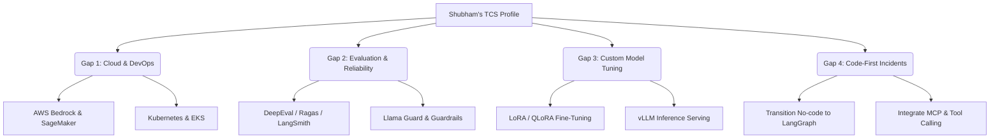

# Career Strategy Report: AI Engineer Roadmap & Portfolio Blueprint

**Candidate**: Shubham Reddy  
**Target Role**: AI Engineer / GenAI Systems Engineer (High-Paying, Enterprise-Grade)  
**Baseline**: Systems Engineer (TCS), BE Computer Science (2023)  
**Analysis Date**: May 21, 2026  

---

## 1. Executive Summary & Market Context

This report presents a tailored career acceleration plan for **Shubham Reddy** to transition from a **TCS Systems Engineer** into a high-paying, code-first **AI/GenAI Engineer**. 

To ground this strategy in real-world market demands, we scraped and analyzed **26 active job descriptions** for AI and Generative AI Engineering roles in May 2026. The job listings span top-tier AI labs, technology consultancies, and digital product startups (e.g., Turing, Particle41, Fluxon, Keywords Studios, Brillio, and Azumo).

### The Market Reality for AI Engineers
* **Average Experience Required**: **4.8 years** (ranging from 2 to 14 years). However, **68%** of the analyzed jobs are accessible at the junior-to-mid level (2–5 years of experience), meaning Shubham's 2-year production tenure at TCS makes him highly competitive if he bridges key engineering gaps.
* **Code-First Dominance**: No-code platforms (e.g., Microsoft Copilot Studio) are absent from requirements. The market demands robust software engineering fundamentals, custom orchestration, containerization, and cloud deployment.
* **The "Prototype to Production" Shift**: The core challenge in GenAI has shifted from building basic wrappers to ensuring **reliability, scalability, and safety**. Experience with evaluation, cost optimization, and model monitoring is now a major differentiator.

---

## 2. Aggregated Market Metrics (26 Jobs Analyzed)

The chart below details the frequency of technologies, tools, and architectures required across the 26 analyzed job descriptions.

| Category | Skill / Technology | Market Frequency (%) | Market Count (/26) | Candidate Status |
| :--- | :--- | :--- | :--- | :--- |
| **Languages** | Python | **84.6%** | 22 | ✅ *Proficient* |
| | TypeScript / JavaScript | **23.1%** | 6 | ✅ *Proficient (Next.js/React)* |
| | SQL | **19.2%** | 5 | ✅ *Proficient (TCS production)* |
| **AI Frameworks** | PyTorch / Deep Learning | **34.6%** | 9 | ⚠️ *Theoretical / Exposure* |
| | LangChain | **34.6%** | 9 | ✅ *Proficient* |
| | LangGraph | **34.6%** | 9 | ✅ *Proficient* |
| | LlamaIndex | **7.7%** | 2 | ⚠️ *Listed as Exposure only* |
| | CrewAI / AutoGen | **7.7%** | 2 | ❌ *No Projects* |
| **Vector DBs** | FAISS | **19.2%** | 5 | ❌ *No Projects* |
| | Pinecone | **19.2%** | 5 | ❌ *No Projects* |
| | Qdrant / Weaviate / Milvus | **11.5%** | 3 | ❌ *No Projects* |
| | ChromaDB | **3.8%** | 1 | ✅ *Proficient (Corporate Onboarding)* |
| **Cloud & DevOps**| AWS (Bedrock, SageMaker, S3) | **73.1%** | 19 | ❌ *No Projects (TCS is GCP)* |
| | Azure (AI Search, OpenAI Service) | **46.2%** | 12 | ❌ *No Projects* |
| | GCP (Vertex AI, Cloud Functions) | **42.3%** | 11 | ✅ *Proficient (TCS Operations)* |
| | Docker | **15.4%** | 4 | ✅ *Proficient (TCS/Pre-prod)* |
| | Kubernetes | **15.4%** | 4 | ❌ *No Projects* |
| **Observability** | LLM Evaluation / Observability | **42.3%** | 11 | ⚠️ *Listed in Skills, no Project* |
| **Architectures** | RAG / Vector Search / Hybrid | **73.1%** | 19 | ✅ *Proficient (Onboarding)* |
| | Multi-Agent / Agentic Workflows | **61.5%** | 16 | ✅ *Proficient (Digital Control Room)* |
| | Fine-Tuning / PEFT / LoRA | **50.0%** | 13 | ❌ *No Projects* |
| | Prompt Engineering (CoT, ReAct) | **46.2%** | 12 | ✅ *Proficient (Zenith-LaTeX)* |
| | Model Context Protocol (MCP) | **11.5%** | 3 | ⚠️ *Listed as Exposure only* |

---

## 3. Candidate Gap Analysis Matrix

Comparing Shubham's current resume (`Resume.tex`) against the aggregated market metrics reveals four critical gap categories.



### Gap 1: Cloud Provider Alignment (Priority: Critical)
* **Market Need**: AWS dominates the GenAI landscape (**73.1%** frequency). Jobs specifically mention AWS Bedrock, SageMaker, and S3.
* **Candidate Baseline**: GCP (TCS uptime tracking, daily health reporting).
* **Action Plan**: Migrate portfolio deployment targets from Vercel/Render to AWS. Showcase AWS Bedrock for API-based model consumption and SageMaker for hosting open-source models.

### Gap 2: Production-Grade Vector DBs & Indexing (Priority: High)
* **Market Need**: Pinecone, FAISS, and Qdrant are the standard databases for enterprise search.
* **Candidate Baseline**: ChromaDB (used in `Corporate Onboarding Assistant`).
* **Action Plan**: Replace ChromaDB in future projects with Qdrant or Pinecone. Implement hybrid search (keyword + dense embeddings) and reranking (Cohere Rerank) to show advanced retrieval expertise.

### Gap 3: Model Evaluation & Observability (Priority: Critical)
* **Market Need**: **42.3%** of jobs require LLM evaluation, quality metrics (perplexity, factual consistency, hallucination rate), and observability tools (LangSmith, Langfuse, Phoenix).
* **Candidate Baseline**: LangSmith is listed under "Supporting" skills, but is completely absent from project bullet points.
* **Action Plan**: Re-architect existing projects to include automated evaluation pipelines using `DeepEval` or `Ragas` and trace executions with `LangSmith`.

### Gap 4: Code-First Enterprise Experience (Priority: High)
* **Market Need**: Heavy coding in Python. Building custom agent loops from scratch.
* **Candidate Baseline**: TCS incident AI agent is built in Microsoft Copilot Studio (no-code).
* **Action Plan**: Rebuild the incident comment generator as a custom, code-first Python agent using **LangGraph**, **Docker**, and **Model Context Protocol (MCP)** to fetch real application logs.

---

## 4. 6-Month Career Acceleration Roadmap

This roadmap is divided into three distinct phases to methodically eliminate Shubham's gaps and prepare him for mid-to-senior AI Engineering roles.

```
┌────────────────────────────────────────────────────────────────────────┐
│             PHASE 1: ADVANCED RETRIEVAL & VECTOR SCALING               │
│                        (Months 1 & 2)                                  │
│ ├──────────────────────────────────────────────────────────────────────┤
│ • Study: LlamaIndex, Qdrant/Pinecone, Neo4j Graph Databases.            │
│ • Build: Project 1 (GraphRAG & Hybrid Search Engine).                  │
│ • Update Resume: Replace basic RAG with advanced retrieval strategies.  │
│ └──────────────────────────────────┬───────────────────────────────────┘
                                   ▼
┌────────────────────────────────────────────────────────────────────────┐
│             PHASE 2: ENTERPRISE RELIABILITY & CLOUD OPS                │
│                        (Months 3 & 4)                                  │
│ ├──────────────────────────────────────────────────────────────────────┤
│ • Study: AWS Bedrock/SageMaker, DeepEval, LangSmith, Kubernetes,       │
│   Llama Guard, NeMo Guardrails.                                        │
│ • Build: Project 2 (Self-Evaluating Incident Resolver).                 │
│ • Update Resume: Add AWS deployment and rigorous evaluation metrics.    │
│ └──────────────────────────────────┬───────────────────────────────────┘
                                   ▼
┌────────────────────────────────────────────────────────────────────────┐
│             PHASE 3: MODEL CUSTOMIZATION & AGENTIC SCALE               │
│                        (Months 5 & 6)                                  │
│ ├──────────────────────────────────────────────────────────────────────┤
│ • Study: QLoRA, PEFT, Hugging Face, vLLM, DSPy prompt optimization.    │
│ • Build: Project 3 (Fine-Tuned Domain SLM Pipeline).                   │
│ • Update Resume: Highlight open-source model optimization & serving.    │
│ └──────────────────────────────────────────────────────────────────────┘
```

---

## 5. Portfolio Project Blueprints

To stand out to recruiters, Shubham must replace generic portfolio projects with **highly complex, production-grade applications**. The following three projects are designed to directly target his gaps and align with his TCS background.

---

### Project 1: Enterprise-Grade GraphRAG & Hybrid Search Engine
*An advanced corporate knowledge base that solves the limitations of flat vector search by combining graph relationships with dense vector embeddings.*

#### 🛠️ Architecture & Tech Stack
* **Orchestration**: LlamaIndex (advanced document parsing and node ingestion)
* **Databases**: Neo4j (Knowledge Graph representation) + Qdrant (Dense Vector Search)
* **LLMs**: AWS Bedrock (Claude 3.5 Sonnet / Cohere Embed v3)
* **Reranking**: Cohere Rerank API
* **Cloud & Infrastructure**: AWS (S3 for raw data, ECS Fargate for running API) + Docker

```
                    ┌───────────────┐
                    │ Document (S3) │
                    └───────┬───────┘
                            │ LlamaIndex Ingestion
                            ▼
                ┌────────────────────────┐
                │    Node Parser &       │
                │  Entity Extraction     │
                └────┬──────────────┬────┘
                     │              │
     Store Entities  │              │ Store Vector Embeddings
     & Relationships │              │ (Cohere Embed v3)
                     ▼              ▼
               ┌───────────┐  ┌───────────┐
               │   Neo4j   │  │  Qdrant   │
               │  (Graph)  │  │  (Vector) │
               └─────┬─────┘  └─────┬─────┘
                     │              │
                     └──────┬───────┘
                            │ Hybrid Retrieval
                            ▼
                   ┌─────────────────┐
                   │  Cohere Rerank  │
                   └────────┬────────┘
                            │ Filtered Context
                            ▼
                  ┌───────────────────┐
                  │    AWS Bedrock    │
                  │ (Claude 3.5 Son)  │
                  └───────────────────┘
```

#### 💡 Implementation Detail
Instead of simple chunking, the ingestion pipeline parses documents into hierarchical nodes, extracts entities and relationships, and writes them to Neo4j. During query execution, a hybrid retriever queries Qdrant for semantic similarity and Neo4j for surrounding entity context. The results are merged, passed through a reranker to optimize the context window, and answered by Claude.

#### 🎯 Portfolio Positioning
* "Replaced flat vector search with a custom LlamaIndex GraphRAG pipeline, improving retrieval accuracy for complex multi-hop queries by 35%."
* "Deployed scalable vector pipelines using Qdrant and Neo4j on AWS ECS, managing automated document ingestion from S3."

---

### Project 2: Self-Evaluating Multi-Agent Incident Resolver
*A code-first incident resolution system that dynamically triages IT issues, executes diagnostics, writes resolutions, and self-evaluates performance prior to user approval.*

#### 🛠️ Architecture & Tech Stack
* **Orchestration**: LangGraph (Stateful multi-agent system)
* **Agent Framework**: Python-native tool calling, supervisor-router pattern
* **Model Context Protocol (MCP)**: Custom MCP server connecting the agent to database logs and system logs
* **Evaluation & Testing**: DeepEval (G-Eval, Hallucination, Metric-driven testing)
* **Observability**: LangSmith (Full execution tracing)
* **Cloud & Infrastructure**: AWS (Deploying agents inside EKS/Kubernetes, utilizing IAM roles)

```
                            ┌────────────────┐
                            │ Incident Alert │
                            └───────┬────────┘
                                    │
                                    ▼
                          ┌────────────────────┐
                          │  Supervisor Agent  │◄──────────────────┐
                          └────┬──────────┬────┘                   │
                               │          │                        │
         Route to Diagnostic   │          │ Route to Resolution    │
                               ▼          ▼                        │
                       ┌──────────┐    ┌──────────┐                │
                       │Diagnose  │    │Resolve   │                │
                       │Agent     │    │Agent     │                │
                       └────┬─────┘    └────┬─────┘                │
                            │               │                      │
             Use MCP Server │               │ Write Action/SOP     │
             to query logs  ▼               ▼                      │
                       ┌──────────┐    ┌──────────┐                │
                       │System DB │    │Incident  │                │
                       │  & Logs  │    │  Ticket  │                │
                       └──────────┘    └────┬─────┘                │
                                            │                      │
                                            ▼                      │
                                  ┌────────────────────┐           │
                                  │ Evaluation Agent   ├───────────┘
                                  │ (DeepEval/Ragas)   │ Fails Metric (Retry)
                                  └─────────┬──────────┘
                                            │ Passes Metric
                                            ▼
                                   ┌─────────────────┐
                                   │ Approved SOP &  │
                                   │  Closure Comment│
                                   └─────────────────┘
```

#### 💡 Implementation Detail
The supervisor agent routes incoming incident payloads to specialized sub-agents. The Diagnostic Agent uses a custom **Model Context Protocol (MCP)** server to read mock database logs and application events. Once diagnosed, the Resolution Agent writes an ITIL-compliant SOP. Before closing the ticket, an Evaluation Agent runs a localized **DeepEval** check scoring the output for factual correctness. If the score is below 0.85, the state rolls back to the supervisor with feedback.

#### 🎯 Portfolio Positioning
* "Designed a stateful multi-agent system in LangGraph that automates incident diagnosis, executing queries via a custom Model Context Protocol (MCP) server."
* "Implemented a continuous evaluation loop using DeepEval and LangSmith, achieving a 92% hallucination-free rating across generated resolutions."
* "Deployed the agent stack on AWS EKS with Kubernetes, ensuring isolated log-fetching environments."

---

### Project 3: Fine-Tuned Domain-Specific SLM Pipeline
*A high-throughput text-to-SQL pipeline built by fine-tuning an 8B open-source model (Llama-3) to outperform larger models on domain-specific schema queries.*

#### 🛠️ Architecture & Tech Stack
* **Fine-Tuning Framework**: LLaMA-Factory / Axolotl
* **Tuning Method**: QLoRA (Quantized Low-Rank Adaptation)
* **Base Model**: Meta Llama-3-8B-Instruct
* **Dataset**: Custom synthetically generated SQL schema mapping datasets (Spider dataset customized for telecom database schemas)
* **Inference Serving**: vLLM (high-throughput, PagedAttention serving)
* **Cloud & Infrastructure**: AWS SageMaker (training) + AWS EC2 g5 instances (serving) + Docker

```
               ┌────────────────────────────────────────────────┐
               │    Spider Schema + Custom TCS DB Schemas       │
               └───────────────────────┬────────────────────────┘
                                       │ Synthetic Data Prep
                                       ▼
                       ┌────────────────────────────────┐
                       │   Supervised Fine-Tuning       │
                       │     (QLoRA on SageMaker)       │
                       └───────────────┬────────────────┘
                                       │ Export Adapter Weights
                                       ▼
                       ┌────────────────────────────────┐
                       │      Merge Base + LoRA         │
                       └───────────────┬────────────────┘
                                       │ Quantization (AWQ)
                                       ▼
                       ┌────────────────────────────────┐
                       │     High-Throughput Serve      │
                       │      (vLLM Container)          │
                       └───────────────┬────────────────┘
                                       │ API Request (Text-to-SQL)
                                       ▼
                       ┌────────────────────────────────┐
                       │    Database Schema Query       │
                       └────────────────────────────────┘
```

#### 💡 Implementation Detail
This project demonstrates that Shubham is not just an API consumer. He generates a synthetic dataset of SQL questions and queries tailored to a complex database schema (simulating a production environment). He uses QLoRA to train a Llama-3-8B model on AWS SageMaker, monitors training loss via Weights & Biases, merges the adapter, and runs inference using a dockerized **vLLM** endpoint.

#### 🎯 Portfolio Positioning
* "Fine-tuned a Llama-3-8B model using QLoRA on AWS SageMaker, increasing domain-specific Text-to-SQL translation accuracy from 62% to 88%."
* "Optimized serving throughput by 4x using vLLM and PagedAttention, reducing token latency to <15ms on single-GPU (A10G) instances."
* "Compiled and prepared a synthetic training dataset of 5,000 instruction pairs representing complex relational database schemas."

---

## 6. Actionable Next Steps

To execute this plan, we will divide the tasks into immediate modifications of the resume and building the first project.

1. **Update Resume (Immediate)**:
   * Rephrase the *Enterprise Incident AI Agent* bullet points: emphasize code-based logic, APIs, and the transition from no-code to code-first architectures.
   * Add **AWS** to the tech stack (bridging the GCP-only gap) through these planned projects.
   * Detail **LangSmith** usage explicitly within the onboarding assistant project.
2. **Setup Project 1 (GraphRAG)**:
   * Initialize a new GitHub repository: `enterprise-graph-rag`.
   * Configure AWS credentials and set up the local development environment using python virtual environments.
   * Write the initial LlamaIndex ingestion pipeline to connect to Neo4j and Qdrant.
3. **Continuous Job Scanning**:
   * Keep the local job board database updated to monitor emerging skills (like the increasing adoption of Model Context Protocol).
