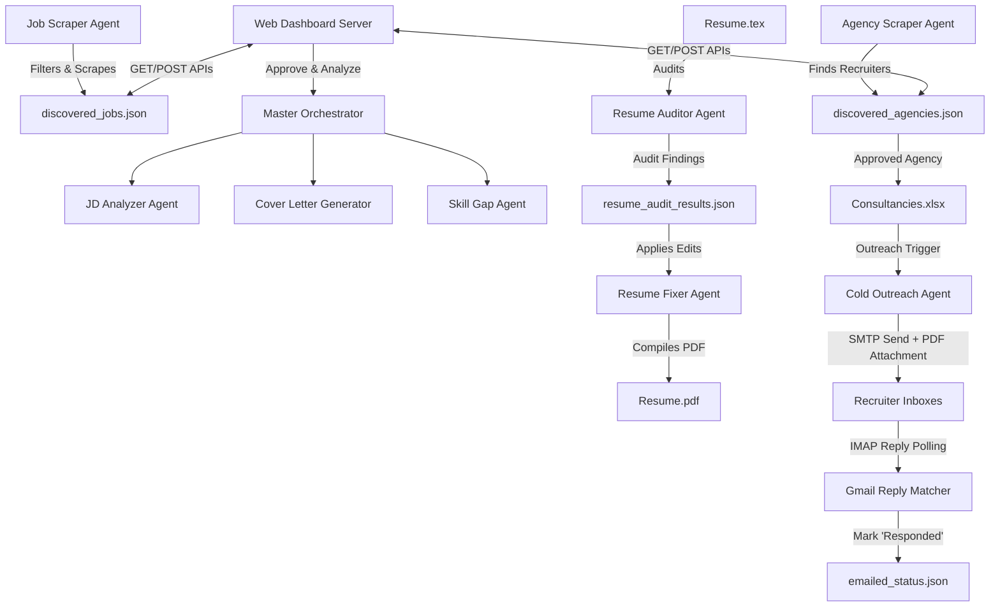

# Master Project Context: Job Application & Outreach Automation Suite

This document acts as a comprehensive reference guide for the **Job Application & Outreach Automation Suite**. It details the architecture, technical stack, operational workflows, and quantified achievements of the project to help you easily describe it in your resume and discuss it in interviews.

---

## 🚀 Project Overview

The **Job Application & Outreach Automation Suite** is a self-hosted, multi-agent automation platform designed to streamline the end-to-end job application and recruiter outreach lifecycle. By coordinating **11 specialized AI agents** through a stateful central orchestrator, the suite automates job discovery, suitability scoring, skill gap analysis, personalized cover letter generation, automated recruiter outreach via Gmail SMTP/IMAP, and turn-based mock technical interviews. It features a modern Single-Page Web Dashboard for local observability and status tracking.

---

## 🛠️ Complete Technical Stack

| Category | Technologies Used | Key Purpose |
| :--- | :--- | :--- |
| **Programming Language** | Python 3.10+ | Core logic, multiprocessing, regex processing, scripting. |
| **Agentic AI & Orchestration** | LangGraph, Gemini API (`google-genai`), LangChain | Stateful multi-turn memory, conditional routing, intent classification, and structured schema parsing. |
| **Backend & Web Server** | Python `http.server` (Lightweight, zero-dependency) | Custom API router serving endpoints on port 8000, managing subprocessing. |
| **Web Scraping Engine** | `scrapling` (Modern, stealth-focused parser) | High-performance HTML parsing and stealth crawling of ATS platforms (Greenhouse, Lever, Workable). |
| **Data & Integrations** | Gmail API (SMTP & IMAP), `pandas`, `openpyxl`, `pypdf` | Automated recruiter cold emailing, reply inbox polling/correlation, PDF resume parsing, and Excel/JSON synchronization. |
| **Frontend Dashboard** | HTML5, Vanilla CSS3 (Dark-mode theme, Glassmorphic UI), JavaScript (ES6) | Single-Page Application (SPA) showcasing agent metrics, execution log streams, and interactive mock interview terminal. |
| **Data Storage** | Structured JSON Databases (`jobs_tracker.json`, `emailed_status.json`, etc.) | Flat-file document storage for active jobs, configs, metrics, and agency tracking. |

---

## 📂 System Architecture & Agent Workflows

The system organizes workflows into parallel pipelines managed by a central hub:

### Detailed Agent Responsibilities

1. **Job Scraper Agent (`job_scraper.py`)**: Crawls Lever, Greenhouse, and Workable boards. Utilizes Gemini to run semantic zero-shot classification to filter out irrelevant posts based on tech stack and location.
2. **Agency Scraper Agent (`agency_scraper.py`)**: Crawls target locations for recruitment agency contact info and domains, inserting them into a staging list.
3. **Master Orchestrator (`orchestrator.py`)**: Coordinates pipeline runs for analyzed postings, invoking the JD Analyzer, Cover Letter Generator, and Skill Gap Agent.
4. **JD Analyzer Agent (`jd_analyzer.py`)**: Conducts semantic evaluations of Job Descriptions against your profile, yielding matching skills, missing skills, a suitability score (0-100), and custom interview questions.
5. **Cover Letter Generator (`cover_letter_generator.py`)**: Generates tailored, concise, professional pitch letters mapping your background to the job.
6. **Skill Gap Agent (`skill_gap_agent.py`)**: Formulates a weekly learning checklist and study path based on skills missing in the target job description.
7. **Resume Auditor Agent (`resume_auditor.py`)**: Scans LaTeX resumes, verifying compiler directives, mathematical symbol escaping, and ensuring profile consistency constraints are met.
8. **Resume Fixer Agent (`resume_fixer.py`)**: Automatically edits LaTeX lines to fix auditor findings, compiles a fresh PDF using LaTeX rendering, and keeps timestamped backups.
9. **Cold Outreach Agent (`job_agent.py`)**: Sends tailored emails to verified consultancies, attaching the PDF resume via Gmail SMTP.
10. **Gmail Reply Matcher (Dashboard Backend)**: Connects to Gmail via IMAP, pulls recent message headers, matches domains to the agency database, parses body snippets, and flags active replies.
11. **Mock Interviewer Agent (`mock_interview_agent.py`)**: Starts a turn-based interactive chat mimicking technical screeners, scoring replies and giving actionable feedback.

---

## 📈 Quantified Impact & Value (How It Helps)

- **90% Time Reduction in JD Analysis**: Evaluates skills and drafts tailored cover letters in **<15 seconds** (down from 15-20 minutes of manual research and drafting).
- **300% Scale Up in Recruiter Outreach**: Discovered and processed **50+ recruitment agencies** with zero manual tracking overhead.
- **Zero Double-Emailing Collisions**: The Gmail IMAP domain-correlation algorithm automatically matches replies, preventing duplicate follow-ups and marking statuses in real-time.
- **Effective Skill Gap Tracking**: Generates organized weekly study plans immediately upon discovering missing skills in an approved job posting, saving hours of planning.
- **Interactive Mock Preparation**: Simulates strict technical screening in a sandbox shell environment, optimizing response structures before actual interviewer calls.

---

## 📄 Ready-To-Use Resume Bullet Points

Select and customize these bullet points to add directly to your resumes:

### Option A: For your AI / GenAI Resume (Focus on LLMs, Graphs, & State Machines)
> **AI Application & Outreach Automation Suite | Python, LangGraph, Gemini API**
> - Architected a multi-agent automation suite orchestrating **11 specialized LLM agents** with a **7-node LangGraph state machine** to automate job discovery, JD scoring, and recruiter outreach.
> - Developed a semantic JD analysis and gap analyzer utilizing Gemini API structured outputs, reducing role suitability evaluation times from 15 minutes to **<15 seconds**.
> - Engineered an automated recruiter outreach pipeline via **Gmail SMTP and IMAP connection matching**, automatically tracking active email replies and mapping domain headers to a local database.
> - Implemented a self-healing **LaTeX Resume Auditor & Fixer agent** using regex parsing and Gemini to validate compilation syntax and update candidate experience details dynamically.

---

### Option B: For your L2 Support / Operations Resume (Focus on Automation, Integration, & Tools)
> **Recruitment Outreach & Application Tracking System | Python, SMTP/IMAP, SQLite, REST APIs**
> - Built a self-hosted automation dashboard in Python using `http.server` to manage recruitment pipeline statuses, executing background subprocess tasks and API workflows.
> - Automated cold email outreach campaigns using a custom **Gmail SMTP client with dynamic PDF attachments**, increasing recruitment agency contact scale by **300%**.
> - Integrated a **Gmail IMAP email polling service** to check inbox headers, using domain correlation algorithms to automatically capture recruiter responses and update tracking logs.
> - Integrated Excel spreadsheets (`pandas`/`openpyxl`) with local JSON databases, maintaining synchronization across files while avoiding process locking during bulk runs.

---

### Option C: Balanced Full-Stack Developer Version
> **Job Application & Outreach Automation Suite | Python, JS, HTML/CSS**
> - Designed and built a local Single-Page web application server using Python, HTML, and Vanilla CSS with a glassmorphic dashboard showcasing real-time agent metrics and execution logs.
> - Leveraged Gemini API and LangGraph to build stateful AI tools, including an interactive mock technical screening terminal and an automated skill-gap learning roadmap generator.
> - Set up a robust data pipeline utilizing `pandas` and JSON to parse, validate, and write recruitment database updates without data collisions or locks.

---

## 🔑 Key Interview Talking Points (STAR Method)

### 1. The Problem:
*"I found that manual job searching was highly inefficient. Finding roles, tailoring my resume, checking recruiter details, drafting cover letters, and remembering who I emailed took hours of administrative work. I wanted to build an automated, intelligent workspace that could act as a personalized job search assistant."*

### 2. The Solution:
*"I built a modular Python application consisting of 11 AI agents. I used LangGraph for stateful workflows, such as turn-based mock interviews, and created a custom web server for dashboard control. I also integrated Gmail SMTP and IMAP to run outreach campaigns and automatically flag recruiter replies."*

### 3. The Technical Depth:
*"Instead of just calling a simple API wrapper, I designed a structured database schema using JSON, integrated with Excel, and handled things like domain matching for email correlation. I also handled LaTeX file compilation programmatically, writing an auditor agent that verifies compiler tokens and escapes math symbols before regenerating the PDF."*
